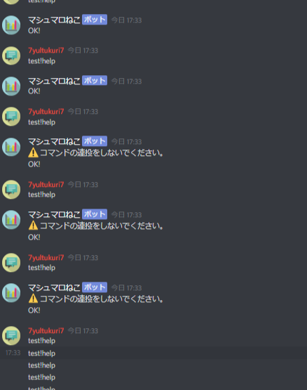
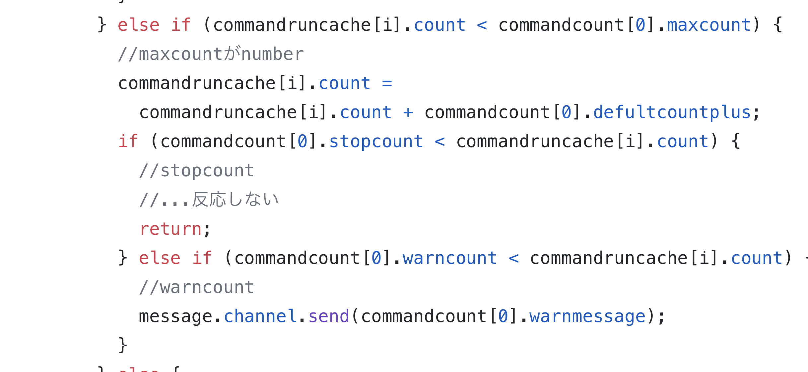

# discord.js-command-anti-spam

# Tags
`discord`

# Short Description
discord bot

command anti spam

コマンドアンチスパム

知識があまりないときに作成したものです。あとで、時間があるとき、コードを変えます。(モジュール化したい)

# Demo

設定した一定以上超えると、警告が出てきます。それでもやめない場合は、無視されます。

# Advantages
無駄な処理をしなくて済む。

# Installation
ググってください。

# Minimal Example

コードを見て、解析してください。

# Contributors
- [7yultukuri7](https://github.com/7yultukuri7)

